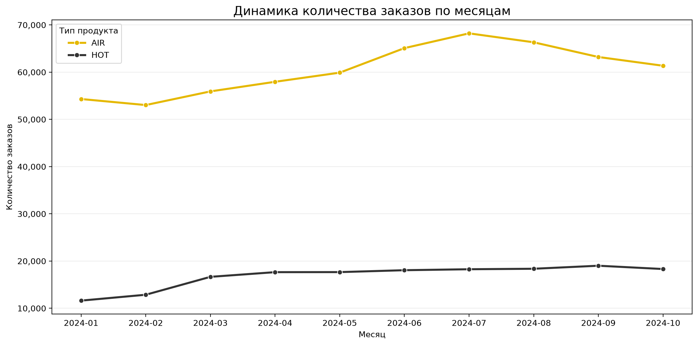
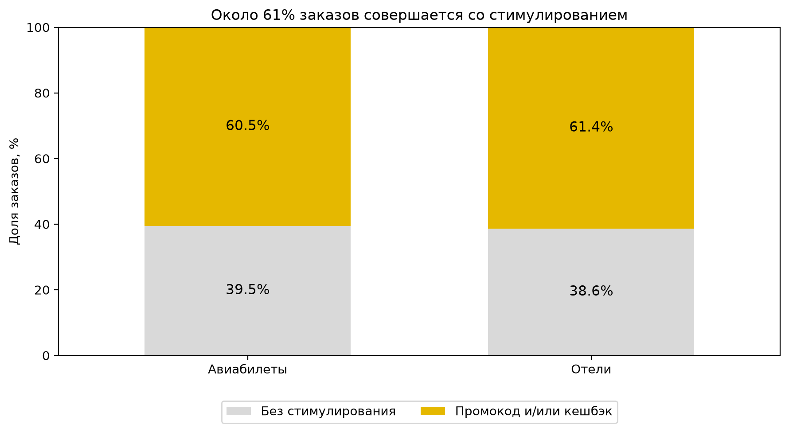
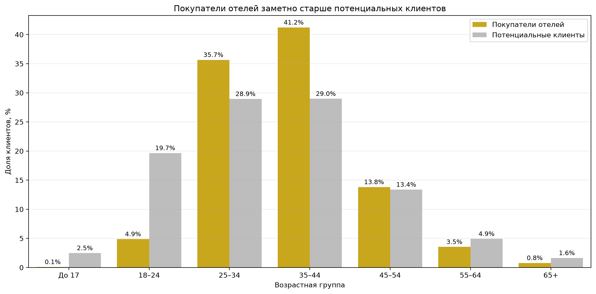
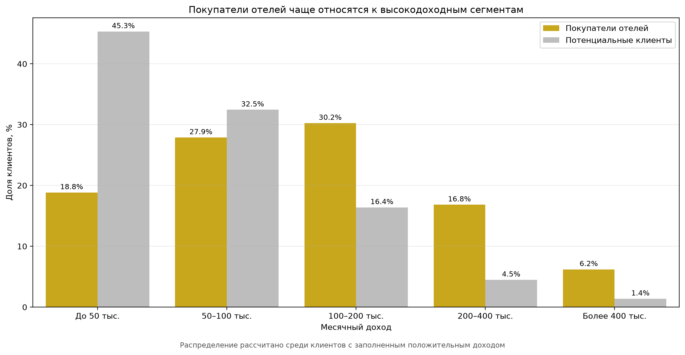

# Анализ данных сервиса «Т-Банк Путешествия»

Учебно-практический проект по продуктовой аналитике на основе открытых данных DANO 2024.

## Цель проекта

Провести разведочный анализ данных о пользователях и заказах сервиса «Т-Банк Путешествия», выявить особенности клиентского поведения, найти потенциальные точки роста продукта, сформулировать продуктовые гипотезы и разработать подход к проверке одной из них с помощью A/B-теста.

## Данные

В проекте используется датасет с информацией:

- о заказах авиабилетов и отелей;
- применении промокодов и дополнительного кешбэка;
- характеристиках клиентов;
- потенциальных клиентах, которые на момент сбора данных ещё не совершили бронирование.

Размер исходного датасета:

- **835 938 строк**;
- **56 признаков**.

В ходе анализа были выделены:

- **786 885 заказов**;
- **49 053 потенциальных клиента**;
- клиентская аналитическая витрина на **96 019 пользователей**.

## Инструменты

**Python · pandas · NumPy · Matplotlib · Jupyter Notebook · gdown**

В проекте применены:

- разведочный анализ данных (EDA);
- проверка качества данных;
- обработка пропусков и типов данных;
- фильтрация и агрегация данных;
- построение клиентской витрины;
- сегментация пользователей;
- анализ поведения клиентов;
- анализ стимулирования;
- продуктовые гипотезы;
- дизайн A/B-теста.

## Этапы анализа

### 1. Знакомство с данными и проверка качества

Проверены:

- структура и размер датасета;
- типы данных;
- пропуски;
- полные дубликаты;
- уникальность идентификаторов;
- корректность дат;
- гранулярность данных.

Отдельно учтены ограничения исходных данных и неоднозначность интерпретации некоторых полей.

### 2. Анализ заказов

Проведён анализ двух продуктовых направлений:

- **AIR** — авиабилеты;
- **HOT** — отели.

Исследованы структура заказов, динамика показателей и особенности поведения пользователей разных продуктовых сегментов.

### 3. Построение клиентской витрины

Данные преобразованы с уровня заказов до уровня клиента.

Сформирована аналитическая таблица, позволяющая сопоставлять характеристики пользователей, их покупательское поведение и использование стимулирования.

### 4. Сегментация пользователей

Проведено сравнение:

- покупателей авиабилетов;
- покупателей отелей;
- потенциальных клиентов.

Проанализированы различия между клиентскими группами и возможные сегменты для продуктового воздействия.

### 5. Анализ стимулирования

Исследовано использование промокодов и дополнительного кешбэка.

Проанализирована связь стимулирования с характеристиками и поведением пользователей. Полученные результаты использованы как основа для формирования продуктовых гипотез.

### 6. Формирование продуктовых гипотез

По результатам анализа сформулированы гипотезы по развитию продукта и повышению эффективности стимулирования пользователей.

Для приоритетной гипотезы определены:

- целевая аудитория;
- предлагаемое изменение;
- ожидаемый эффект;
- метрики для оценки результата;
- ограничения анализа.

### 7. Дизайн A/B-теста

Для проверки выбранной продуктовой гипотезы разработан дизайн эксперимента:

- контрольная и тестовая группы;
- основная метрика;
- дополнительные и защитные метрики;
- критерий принятия решения по результатам эксперимента.

## Результат

Проект демонстрирует полный цикл продуктового анализа:

**исходные данные → проверка качества → EDA → клиентская витрина → сегментация → анализ поведения → продуктовые гипотезы → дизайн эксперимента.**

Код, расчёты, промежуточные результаты, выводы и ограничения исследования представлены в Jupyter Notebook.

## Визуализации

### Динамика заказов



### Использование стимулирования



### Возрастные сегменты



### Сегменты по доходу



## Notebook

Полный анализ с кодом и выводами:

**[Открыть Jupyter Notebook](notebooks/tbank_travel_analysis.ipynb)**

## Структура репозитория

```text
product-analytics-tbank-travel/
│
├── data/
│   └── README.md
│
├── images/
│   ├── age_segments.png
│   ├── income_segments.png
│   ├── orders_by_month.png
│   └── stimulus_share.png
│
├── notebooks/
│   └── tbank_travel_analysis.ipynb
│
├── .gitignore
├── README.md
└── requirements.txt

Папка `data/` создаётся локально при запуске проекта и не публикуется в GitHub.

## Источник данных

В проекте используется открытый датасет DANO 2024.

- **Официальная страница:** https://dano.hse.ru/data2024
- **Формат:** CSV
- **Размер:** 835 938 строк × 56 признаков

Исходный файл не хранится в репозитории из-за большого размера. При первом запуске Jupyter Notebook датасет автоматически загружается из публичного источника DANO.

## Как запустить проект

### 1. Клонировать репозиторий

```bash
git clone https://github.com/anastasia-korol/product-analytics-tbank-travel.git
```

### 2. Перейти в папку проекта

```bash
cd product-analytics-tbank-travel
```

### 3. Установить необходимые библиотеки

```bash
pip install -r requirements.txt
```

### 4. Запустить JupyterLab

```bash
jupyter lab
```

### 5. Открыть notebook

```text
notebooks/tbank_travel_analysis.ipynb
```

Запустить ячейки последовательно сверху вниз.

При первом запуске исходный датасет автоматически загружается в локальную папку `data/`. Исходные данные исключены из Git через `.gitignore`.

## Автор

**Анастасия Король**

Продуктовый аналитик / аналитик данных.

В проекте продемонстрированы навыки работы с Python и pandas, разведочного анализа данных, построения клиентской витрины, сегментации, формирования продуктовых гипотез и проектирования A/B-теста.

**GitHub:** https://github.com/anastasia-korol
